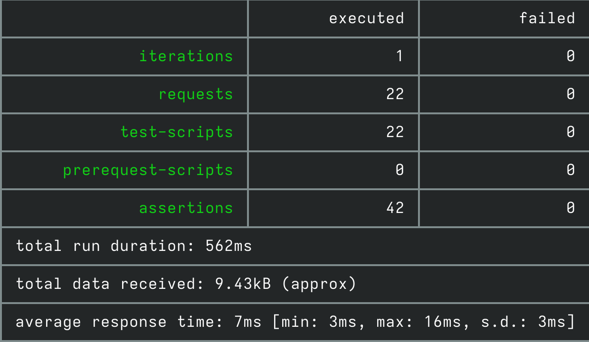
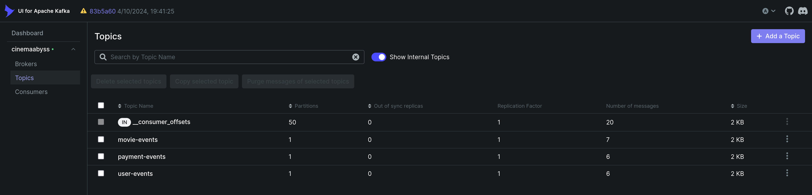
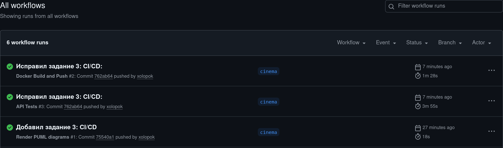
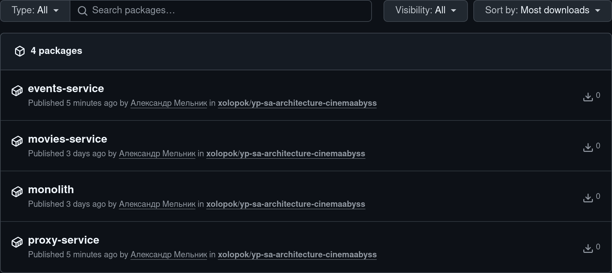
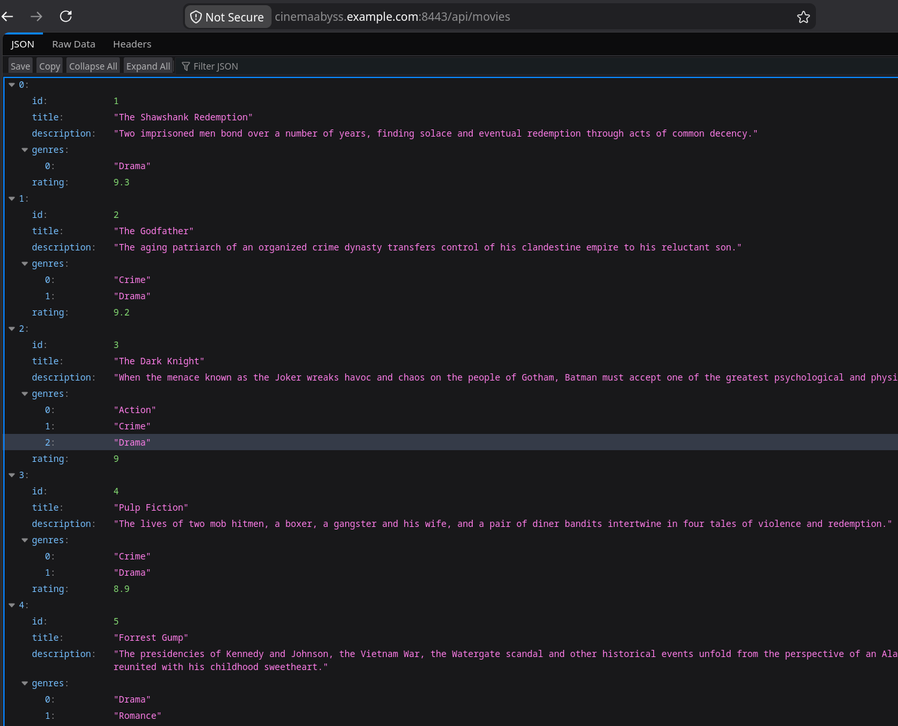
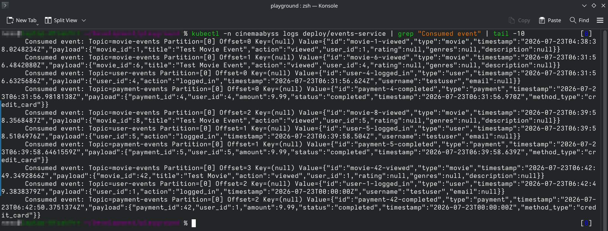

# Изучите [README.md](./README.md) файл и структуру проекта.

## Задание 1

### Анализ

**Домен**

Онлайн кинотеатр-аггрегатор.

**Поддомены**

Ключевые:

- Каталог фильмов, Подписки

Вспомогательные:

- Рекомендации, Система лояльности

Прочие:

- Учетные данные, Платежи, Уведомления, Видеофайлы

**Ограниченные контексты**

- Movies (Write/Read, CQRS)
- Subscriptions,
- Recommendations,
- Loyalty
- Identity,
- Payments,
- Video,
- Notifications

_Для упрощения диаграм все сервисы в общем PostgreSQL-кластере. У каждого сервиса своя БД._

**Исходное состояние системы**

- [Контекст (AS IS)](docs/architecture/context.png)
- [Контейнеры (AS IS)](docs/architecture/containers-asis.png)

_Исходил из собственного представления о том как может быть устроена система. Код в репозитории сильно упрощен._

### Промежуточное решение (Strangler Fig)

Новый доменный сервис Movies.

Прокси сервис маршрутизирует трафик следующим образом:
- Не-movies трафик всегда идёт в монолит.
- `GRADUAL_MIGRATION=true`: случайное число 0–99 < `MOVIES_MIGRATION_PERCENT` ? movies-трафик идёт в новый сервис : movies-трафик идёт в монолит.
- `GRADUAL_MIGRATION=false`: movies-трафик идёт в новый сервис.

_По примеру из задания 2._

Между монолитом и новым сервисом стоит ACL-адаптер.

**Промежуточное состояние системы**
- [Контейнеры: миграция (Strangler Fig)](docs/architecture/containers-tobe-migration.png)

### Конечное решение

Монолит и ACL отсутствуют. Вместо прокси сервиса отдельные BFF под каждое приложение. Для асинхронного взаимодействия используется Kafka.

**Конечное состояние системы**

Фронтенды:

- [Контейнеры: Web BFF (TO BE)](docs/architecture/containers-tobe-frontends-web.png)
- [Контейнеры: Mobile BFF (TO BE)](docs/architecture/containers-tobe-frontends-mobile.png)
- [Контейнеры: Smart TV BFF (TO BE)](docs/architecture/containers-tobe-frontends-smarttv.png)
- [Контейнеры: Operator BFF (TO BE)](docs/architecture/containers-tobe-frontends-operator.png)

Сервисы:

- [Контейнеры: сервисы и базы данных (TO BE)](docs/architecture/containers-tobe-services-persistence.png)
- [Контейнеры: сервисы и сообщения (TO BE)](docs/architecture/containers-tobe-services-communication.png)

Прочее:
- [Контейнеры: внешние зависимости (TO BE)](docs/architecture/containers-tobe-ext-deps.png)
- [Контейнеры: observability (TO BE)](docs/architecture/containers-tobe-observability.png)

## Задание 2

_Я поднял версию Node до 22 и поправил скрипты. У меня не получилось запустить тесты как есть: yargs 17.6.2 падает на Node ≥ 20._

_Я добавил bash-скрипты в `tests/scripts/` для быстрого тестирования без Node._

**Сервис Proxy (C#, .NET 10)**

Точка входа: `src/microservices/proxy/Program.cs`.

Маршрутизация:
- Не-movies трафик всегда идёт в монолит.
- `/api/movies` и `/api/movies/*` маршрутизируются в сервис movies:
  - `GRADUAL_MIGRATION=true`: случайное число `0–99 < MOVIES_MIGRATION_PERCENT`, то сервис movies, иначе монолит.
  - `GRADUAL_MIGRATION=false`: весь movies-трафик идёт в movies-сервис.

Тест:
```bash
curl http://localhost:8000/health        # Должен вернуть "Strangler Fig Proxy is healthy"
curl http://localhost:8000/api/movies    # Должен вернуть список фильмов
```

Для проверки постепенного перехода нужно изменить `MOVIES_MIGRATION_PERCENT` в `docker-compose.yml` (0 — весь movies-трафик в монолит, 100 — весь в movies-сервис) и перезапустить `proxy-service`.

**Сервис Events (C#, .NET 10, Kafka)**

Точка входа: `src/microservices/proxy/Program.cs`.

Тест:
```bash
cd tests/postman/
npm run test:local
```

Отчёты в `tests/postman/reports/`.

Тесты:


Топики Kafka:


## Задание 3

### CI/CD

- [x] Доработан `.github/workflows/docker-build-push.yml`

- [x] Сборка зелёная, тесты зелёные

  

- [x] Образы появились в GitHub Registry (ghcr.io)

  

### Kubernetes — Шаг 1

- [x] Создан PAT (classic) с правом `read:packages`

- [x] Отредактированы пути до образов в `src/kubernetes/*.yaml`

- [x] Выполнен `docker login ghcr.io` (в `~/.docker/config.json` есть auth для ghcr.io)

- [x] В `src/kubernetes/dockerconfigsecret.yaml` добавлен base64 от `~/.docker/config.json`

### Kubernetes — Шаг 2

- [x] Доработан `src/kubernetes/event-service.yaml` (Deployment + Service)

- [x] Доработан `src/kubernetes/proxy-service.yaml` (Deployment + Service)

- [x] Доработан `src/kubernetes/ingress.yaml`

- [x] Создан namespace:

  ```bash
  kubectl apply -f src/kubernetes/namespace.yaml
  ```

- [x] Применены секреты и переменные:

  ```bash
  kubectl apply -f src/kubernetes/configmap.yaml
  kubectl apply -f src/kubernetes/secret.yaml
  kubectl apply -f src/kubernetes/dockerconfigsecret.yaml
  kubectl apply -f src/kubernetes/postgres-init-configmap.yaml
  ```

- [x] Развёрнута БД:

  ```bash
  kubectl apply -f src/kubernetes/postgres.yaml
  ```

- [x] Развёрнута Kafka:

  ```bash
  kubectl apply -f src/kubernetes/kafka/kafka.yaml
  ```

- [x] Развёрнут монолит:

  ```bash
  kubectl apply -f src/kubernetes/monolith.yaml
  ```

- [x] Развёрнуты сервисы:

  ```bash
  kubectl apply -f src/kubernetes/movies-service.yaml
  kubectl apply -f src/kubernetes/events-service.yaml
  kubectl apply -f src/kubernetes/proxy-service.yaml
  ```

- [x] Все поды в Running:

  ```bash
  kubectl -n cinemaabyss get pod
  NAME                              READY   STATUS    RESTARTS      AGE
  events-service-8d59dc8cd-xc8kv    1/1     Running   0             2m19s
  kafka-0                           1/1     Running   2 (60s ago)   2m41s
  monolith-d5c9ff994-xhkh7          1/1     Running   0             2m31s
  movies-service-676ff9f4c9-g6z6z   1/1     Running   0             2m25s
  postgres-0                        1/1     Running   0             2m50s
  proxy-service-5f48b754bb-dxkcz    0/1     Running   0             2m13s
  zookeeper-0                       1/1     Running   0             2m41s
  ```

- [x] Включён аддон ingress:

  ```bash
  minikube addons enable ingress
  kubectl apply -f src/kubernetes/ingress.yaml
  ```

- [x] В `/etc/hosts` добавлено `127.0.0.1 cinemaabyss.example.com`

  ```bash
  echo "127.0.0.1 cinemaabyss.example.com" | tee -a /etc/hosts
  getent hosts cinemaabyss.example.com
  127.0.0.1       localhost
  ```

- [x] Запущен `minikube tunnel`

  _Запускал без sudo так:_

  ```bash
  kubectl -n ingress-nginx port-forward svc/ingress-nginx-controller 8080:80 8443:443
  ```

  _Если работает нестабильно, то нужно ограничить количество ресурсов (один раз после `minikube start`):_

  ```bash
  kubectl -n ingress-nginx patch configmap ingress-nginx-controller --type merge -p '{"data":{"worker-processes":"2"}}'
  ```

- [x] `https://cinemaabyss.example.com/api/movies` возвращает список фильмов

- [x] Проверено переключение трафика через `MOVIES_MIGRATION_PERCENT` в `src/kubernetes/configmap.yaml`

- [x] Запущены тесты `npm run test:kubernetes`

  ```bash
  ┌─────────────────────────┬──────────────────┬──────────────────┐
  │                         │         executed │           failed │
  ├─────────────────────────┼──────────────────┼──────────────────┤
  │              iterations │                1 │                0 │
  ├─────────────────────────┼──────────────────┼──────────────────┤
  │                requests │               22 │                0 │
  ├─────────────────────────┼──────────────────┼──────────────────┤
  │            test-scripts │               22 │                0 │
  ├─────────────────────────┼──────────────────┼──────────────────┤
  │      prerequest-scripts │                0 │                0 │
  ├─────────────────────────┼──────────────────┼──────────────────┤
  │              assertions │               42 │                0 │
  ├─────────────────────────┴──────────────────┴──────────────────┤
  │ total run duration: 3s                                        │
  ├───────────────────────────────────────────────────────────────┤
  │ total data received: 7.7kB (approx)                           │
  ├───────────────────────────────────────────────────────────────┤
  │ average response time: 16ms [min: 5ms, max: 64ms, s.d.: 14ms] │
  └───────────────────────────────────────────────────────────────┘
  ```

### Kubernetes — Шаг 3

- [x] Скриншот `https://cinemaabyss.example.com/api/movies`

  

- [x] Скриншот логов event-service

  

## Задание 4
Для простоты дальнейшего обновления и развертывания вам как архитектуру необходимо также реализовать Helm-чарты для прокси-сервиса и проверить работу

Для этого:
1. Перейдите в директорию helm и отредактируйте файл values.yaml

```yaml
# Proxy service configuration
proxyService:
  enabled: true
  image:
    repository: ghcr.io/db-exp/cinemaabysstest/proxy-service
    tag: latest
    pullPolicy: Always
  replicas: 1
  resources:
    limits:
      cpu: 300m
      memory: 256Mi
    requests:
      cpu: 100m
      memory: 128Mi
  service:
    port: 80
    targetPort: 8000
    type: ClusterIP
```

- Вместо ghcr.io/db-exp/cinemaabysstest/proxy-service напишите свой путь до образа для всех сервисов
- для imagePullSecret проставьте свое значение (скопируйте из конфигурации kubernetes)
  ```yaml
  imagePullSecrets:
      dockerconfigjson: ewoJImF1dGhzIjogewoJCSJnaGNyLmlvIjogewoJCQkiYXV0aCI6ICJaR0l0Wlhod09tZG9jRjl2UTJocVZIa3dhMWhKVDIxWmFVZHJOV2hRUW10aFVXbFZSbTVaTjJRMFNYUjRZMWM9IgoJCX0KCX0sCgkiY3JlZHNTdG9yZSI6ICJkZXNrdG9wIiwKCSJjdXJyZW50Q29udGV4dCI6ICJkZXNrdG9wLWxpbnV4IiwKCSJwbHVnaW5zIjogewoJCSIteC1jbGktaGludHMiOiB7CgkJCSJlbmFibGVkIjogInRydWUiCgkJfQoJfSwKCSJmZWF0dXJlcyI6IHsKCQkiaG9va3MiOiAidHJ1ZSIKCX0KfQ==
  ```

2. В папке ./templates/services заполните шаблоны для proxy-service.yaml и events-service.yaml (опирайтесь на свою kubernetes конфигурацию - смысл helm'а сделать шаблоны для быстрого обновления и установки)

```yaml
template:
    metadata:
      labels:
        app: proxy-service
    spec:
      containers:
       Тут ваша конфигурация
```

3. Проверьте установку
Сначала удалим установку руками

```bash
kubectl delete all --all -n cinemaabyss
kubectl delete namespace cinemaabyss
```
Запустите
```bash
helm install cinemaabyss ./src/kubernetes/helm --namespace cinemaabyss --create-namespace
```
Если в процессе будет ошибка
```text
[2025-04-08 21:43:38,780] ERROR Fatal error during KafkaServer startup. Prepare to shutdown (kafka.server.KafkaServer)
kafka.common.InconsistentClusterIdException: The Cluster ID OkOjGPrdRimp8nkFohYkCw doesn't match stored clusterId Some(sbkcoiSiQV2h_mQpwy05zQ) in meta.properties. The broker is trying to join the wrong cluster. Configured zookeeper.connect may be wrong.
```

Проверьте развертывание:
```bash
kubectl get pods -n cinemaabyss
minikube tunnel
```

Потом вызовите
`https://cinemaabyss.example.com/api/movies`
и приложите скриншот развертывания Helm и вывода `https://cinemaabyss.example.com/api/movies`

### Удаляем все

```bash
kubectl delete all --all -n cinemaabyss
kubectl delete namespace cinemaabyss
```
